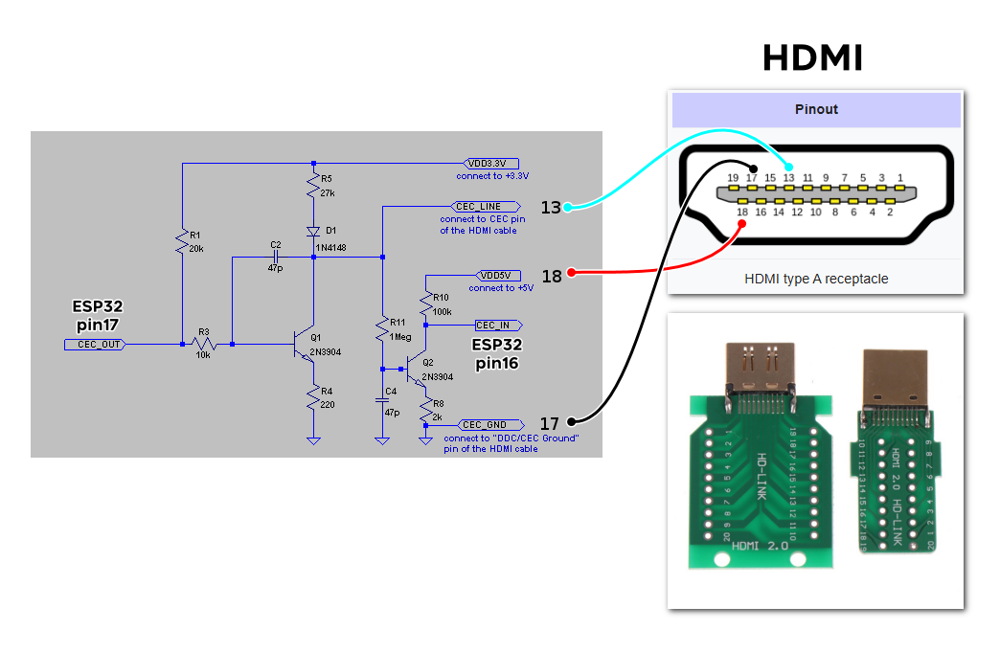
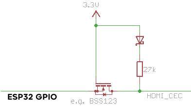

# BlynkGO CEClient
HDMI CEC communication for ESP32  
  

  

  
  

  

  
  
## Credit
 - Original code at: https://code.google.com/archive/p/cec-arduino/ (c) Phil Burr and Andrew N. Carr  
 - Based on the work of Florian Echtler: https://github.com/floe/CEC  

